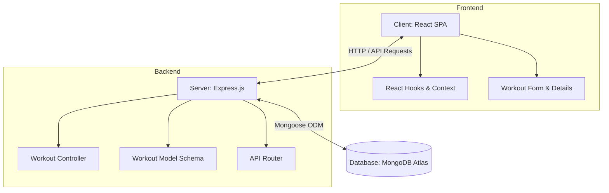

# 🏋️‍♂️ WorkOut - Full-Stack Workout Tracker

[](https://mongodb.com)
[](https://react.dev)
[](https://nodejs.org)
[](https://expressjs.com)
[](https://www.mongodb.com)

WorkOut is a sleek, modern, and highly responsive web application designed to help fitness enthusiasts log and monitor their daily workout routines. Easily track exercise names, weights (loads), and repetitions to hit your fitness goals!

### 🔗 Live Links
- **Frontend App (Vercel)**: [https://workout-singh.vercel.app/](https://workout-singh.vercel.app/)
- **Backend API (Render)**: [https://workout-singh.onrender.com/](https://workout-singh.onrender.com/)

---

## 🚀 Features

- **Robust CRUD Operations**: Add, view, and delete workouts seamlessly in real-time.
- **Dynamic State Management**: Driven by React Context API to ensure local state and backend are instantly synchronized.
- **Form Validation**: Clean error handling to verify all fields (exercise title, load, and reps) are correctly filled out.
- **RESTful API**: Fast and clean API endpoints designed with Express and managed using Mongoose.
- **Elegant UI**: Styled with responsive, clean layouts featuring interactive elements.

---

## 🛠️ Tech Stack & Architecture



### Frontend
- **React**: Component-driven UI.
- **React Context API**: Global state management to dispatch actions (`SET_WORKOUTS`, `CREATE_WORKOUT`, `DELETE_WORKOUT`).
- **Date-fns**: Elegant formatting of workout timestamps.

### Backend
- **Node.js & Express**: Handling incoming API endpoints and routing.
- **Mongoose**: Modeling application data and interacting with MongoDB.
- **Dotenv**: Safe management of secrets and environment variables.

---

## 📂 Project Structure

```text
WorkOut/
├── backend/
│   ├── controllers/      # Route controllers (workoutController.js)
│   ├── models/           # Mongoose schemas (workoutModel.js)
│   ├── routes/           # Express router endpoints (workout.js)
│   ├── .env              # Backend configuration & credentials (ignored by git)
│   ├── package.json      # Node scripts & dependencies
│   └── server.js         # Entry point for backend Express app
└── frontend/
    ├── public/           # Static assets
    ├── src/
    │   ├── components/   # Reusable UI components (Navbar, WorkoutDetails, WorkoutForm)
    │   ├── context/      # React Context definitions
    │   ├── hooks/        # Custom React hooks (useWorkoutsContext)
    │   ├── pages/        # Main application views (Home.js)
    │   ├── App.js        # Main React container
    │   └── index.js      # React DOM entry point
    └── package.json      # React scripts & dependencies
```

---

## 🏁 Getting Started

Follow these steps to run the application locally on your machine.

### Prerequisites
- Make sure you have **Node.js** (v16+) and **npm** installed.
- Access to a **MongoDB** database (locally or via MongoDB Atlas).

---

### Step 1: Clone the Repository
```bash
git clone https://github.com/Krish-Prasad09/Workout-Singh.git
cd WorkOut
```

### Step 2: Backend Setup & Configuration
1. Navigate to the backend directory:
   ```bash
   cd backend
   ```
2. Install dependencies:
   ```bash
   npm install
   ```
3. Create a `.env` file inside the `backend` directory (a template is provided below):
   ```env
   PORT=4000
   MONGO_URI=your_mongodb_connection_string
   ```
4. Start the backend server in development mode (using nodemon):
   ```bash
   npm run dev
   ```
   *The server will spin up on http://localhost:4000*

---

### Step 3: Frontend Setup
1. Open a new terminal window and navigate to the frontend directory:
   ```bash
   cd frontend
   ```
2. Install dependencies:
   ```bash
   npm install
   ```
3. Start the React development server:
   ```bash
   npm start
   ```
   *The client will open in your browser at http://localhost:3000*

---

## 🔌 API Documentation

| Method | Endpoint | Description | Request Body |
| :--- | :--- | :--- | :--- |
| **GET** | `/api/workouts` | Retrieve all workouts | None |
| **GET** | `/api/workouts/:id` | Get a specific workout | None |
| **POST** | `/api/workouts` | Add a new workout | `{ "title": "Bench Press", "load": 80, "reps": 10 }` |
| **DELETE** | `/api/workouts/:id` | Delete a specific workout | None |
| **PATCH** | `/api/workouts/:id` | Update a specific workout | `{ "load": 85 }` |

---

## 🤝 Contributing

Contributions make the open source community such an amazing place to learn, inspire, and create.
1. Fork the Project
2. Create your Feature Branch (`git checkout -b feature/AmazingFeature`)
3. Commit your Changes (`git commit -m 'Add some AmazingFeature'`)
4. Push to the Branch (`git push origin feature/AmazingFeature`)
5. Open a Pull Request

---

## 📄 License

Distributed under the ISC License. See `LICENSE` for more information.
